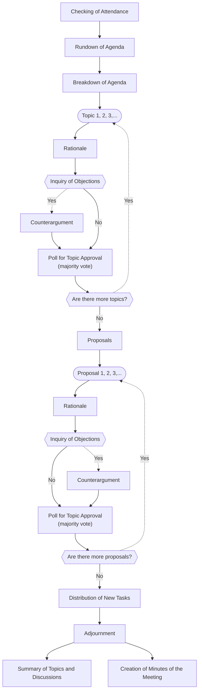
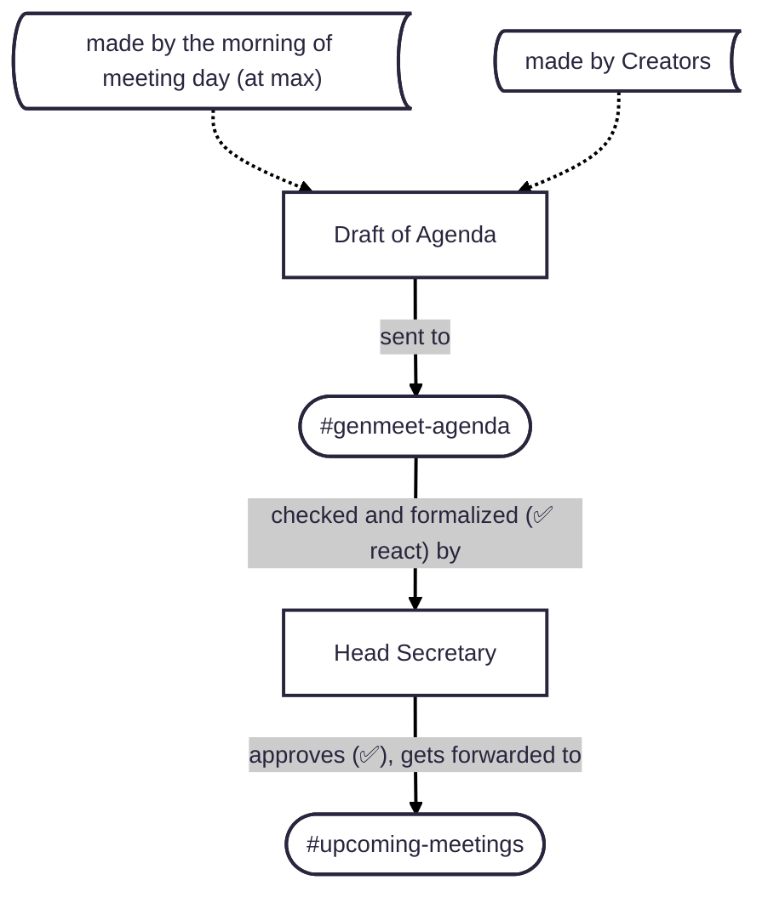
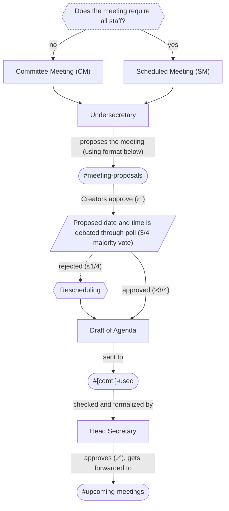
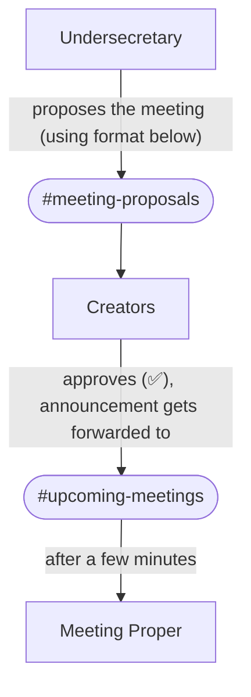
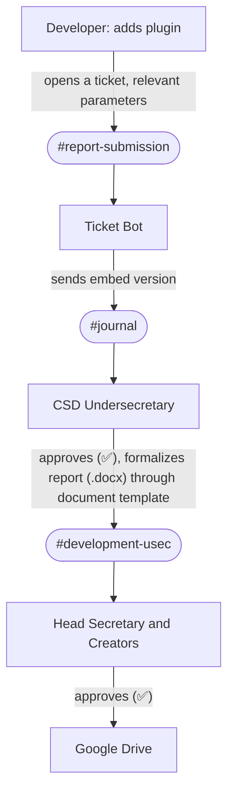

# Centralized Documentation System
- All minutes, agendas, proposals, announcements, server errors, journals, warning or ban logs, etc., as documents (duly signed)
- Babase sa journal channel (react ako ng check if na-document na) at sa excel completed tasks ng bawat member
- These documents be stored and organized in a Google Drive file
- Appointment of a Head Secretary and Committee Undersecretaries must be held
> *The addition of other important documents and the omission of unnecessary ones is to be discussed.*
# Division of Committees
The rationale behind this is so that the staff may perform meetings specific to their roles.
- Committee on Moderation and Administration (CMA)
	- For Admins and Moderators
- Committee on Media Communications (CMC)
	- For Media members
	- *I might create more internal subroles soon* 
- Committee on Server Development Committee (CSD)
	- For Developers
- Committee on Public Works and Design (CPWD)
	- For Builders
Therefore, there should be text and voice channels (proposed) for these departments as well.

> *Notes:*
> *More roles in a specific department may be added or removed. 
> Committee names are subject to change.*
# Meeting Classifications

|      Meeting Type      |                                         Purpose                                          |                    Attendance                    |    Agenda    |
|:----------------------:|:----------------------------------------------------------------------------------------:|:------------------------------------------------:|:------------:|
|  General Meeting (GM)  |  For general server-wide discussions. Regular schedule (e.g., every Saturday evening).   |                    All staff                     |   Required   |
| Committee Meeting (CM) |                           For committee-specific discussions.                            | All committee members, not necessarily exclusive |   Required   |
| Scheduled Meeting (SM) | For discussing new findings, proposals, and urgent changes that cannot wait for the GM.  |                    All staff                     |   Required   |
|  Urgent Meeting (UM)   | For emergency on-the-spot discussions, possibly due to player behavior or server errors. |         All concurrently available staff         | Not required |
###  The Meeting Process

# Proposal of Meetings
### General Meeting (GM)

### Committee Meeting (CM) and Scheduled Meeting (SM)

**FORMAT:**
> @everyone
> ## Committee Meeting Proposal
> Who: @Media 
> When: Sunday, September 21, 2025, 09:30 pm
> Agenda:
> - Media Role Expansion
> - News Edit Approval
> - Video Schedule Approval
> Awaiting for approval from @Creators.

> @everyone
> ## Staff Meeting Proposal
> Who: All staff 
> When: Sunday, September 21, 2025, 09:30 pm
> Agenda:
> - Centralized Documentation System
> - Installation of Server Optimization Plugins
> - Distribution of New Tasks
> Awaiting for approval from @Creators. 
### Urgent Meeting (UM)

**FORMAT:**
> @everyone
> ## Urgent Meeting Proposal
> Who: @Administrator, @Moderator (All Staff for all staff)
> Why: Player shabu_user69420 abused an exploit.
> Awaiting for approval from @Creators. 
# Actions
- Creation of a unified Google Drive file
- Appointment of secretary(ies)
- Creation of document templates
- The creation of the following text and voice channels for the departments:
	- `#media-committee`
	- `#moderation-committee`
	- `#development-committee`
- The creation of the following text channels for meeting proposals:
	- `#meeting-proposals`
	- `#upcoming-meetings`
# Code and Citation of Files
- Meeting: `M-WGM-2025-07-15-001`
- Department Meeting: `M-[meetingType]-[departmentAcronym]-[yearNumber]-[monthNumber]-[dayNumber]-[meetingNumber]`
	- `M-UM-DMC-2025-07-15-001`
	- `M-DSD-2025-10-25-015`
- Meeting: `M-[meetingType/departmentAcronym]`

General Meeting: `M-GM-001-20250915`, cited as GM 001
Department Meeting: `M-CMC-001-20250915`, cited as CMC 001
Urgent Meeting: `M-UM-001-20250915`, cited as UM 001

## Types of Documents
- Agenda
- Minutes of the Meeting
- Development Report
- Error Report
- Troubleshoot Report
## Example Workflow

Pros 
- Easy navigation and access to server events and logs
- Makes troubleshooting more convenient
- Gives meeting absentees the ability to catch up to missed discussions
Cons
- Very tedious 

**Gawing numbers yung sa process, as in step by step**
- Add more example workflows
- Add journal report template
- Where does Undersecretary forward `.docx` report at Example Workflow 4

1. Checking of Attendance
2. Rundown of Agenda (may be none or informal for urgent meetings)
3. Breakdown of Agenda
	- Topic #1 
		- Rationale
		- Inquiry of Objections
			- Counterargument
		- Poll for Topic Approval (majority vote)
	- Topic #2
	- Topic #3
4. Proposals
	- Proposal #1
		- Rationale
		- Inquiry of Objections
			- Counterargument
		- Poll for Proposal Approval (majority vote)
	- Proposal #2
	- Proposal #3
5. Distribution of New Tasks
6. Adjournment
	- Summary of Topics and Decisions
	- Creation of Minutes of the Meeting

1. A developer adds a new plugin with commands.
2. They open a ticket in `#report-submission`, choose the appropriate parameters, and explain their report there.
3. The ticket bot sends an embed of the report in `#journal`.
4. The CSD Undersecretary formalizes the embed report in `#journal` through a development report template document.
5. The CSD Undersecretary forwards the `.docx` report to the Head Secretary and Owners for approval.
6. Once approved, the Head Secretary uploads the document file in its respective Google Drive folder.
wdawd
7. A draft of the agenda must be made by the morning of the scheduled day
- The draft, via a simple Discord message, is forwarded to the Secretary
- A temporary agenda document is sent by the Secretary to the `#upcoming-meetings` (proposed) channel for notice of the staff
- The finished agenda document with the date and time of the meeting is sent by the secretary in the `#upcoming-meetings` (proposed) channel

> @everyone
   I request that a scheduled meeting for all staff be commenced on Sunday, September 21, 2025, 09:30 pm, with the agenda:
> - Media Role Expansion
> - News Edit Approval
> - Video Upload Schedule 
   Awaiting for approval from @Creators. Thank you.

- same as steps ganire ganyan sa GM
- May be requested in the `#meeting-proposals` (proposed) channel in the example format: 

> @everyone
> ## Scheduled Meeting Proposal
> Who: @Media (All Staff for all staff)
> When: Sunday, September 21, 2025, 09:30 pm
> Agenda:
> - Media Role Expansion
> - News Edit Approval
> - Video Schedule Approval
> Awaiting for approval from @Creators. 

  - A poll regarding the proposed date and time must first be held, with a 3/4 majority vote
  - If the date and time is rejected, a rescheduling is commenced
  - Once approved, the meeting shall be scheduled at the proposed date and time