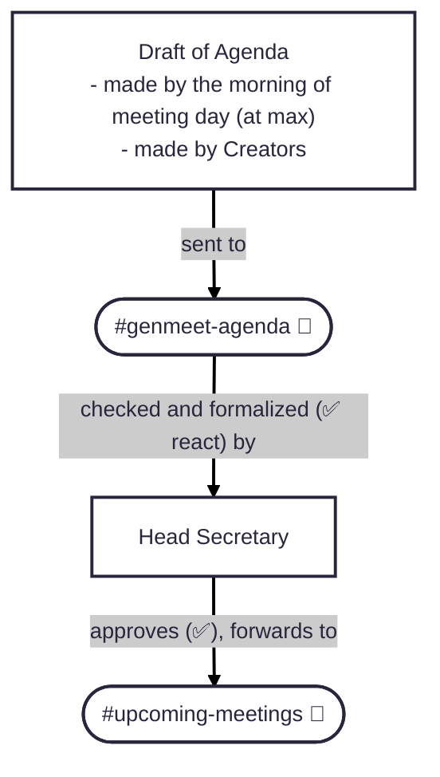
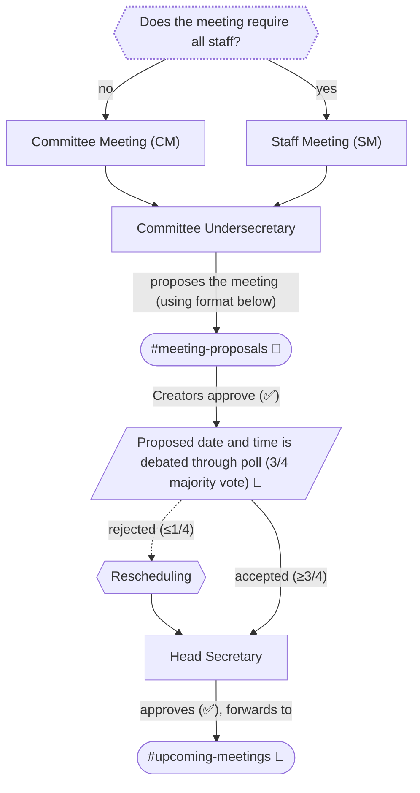
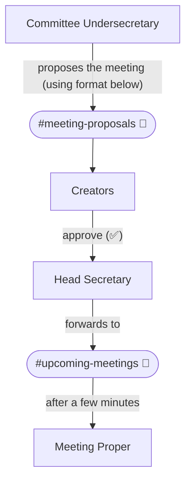
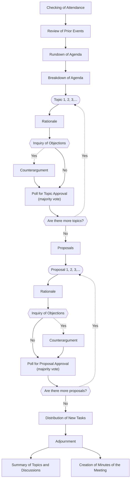
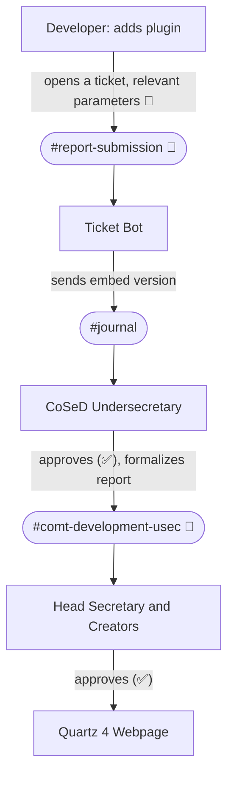

> [!info] 
> | Committee        | [[Council of Secretaries]] |
> | ---------------- |:----------------------------------- |
> | **Proponent(s)** | [[Shinjiru]]               |
> | **Date**         | [[2025-09-20 (Sat)]]  |
> | **Time In**      |                        |
> | **Time Out**     |                       |
> | **Previous**      |                 [[DEV-COS-006-20250918]]                    |
> | **Next**               |                [[DEV-COS-008-20250920]]                   |

---
> [!important] Major System Change
> - It appears that using Google Drive to store reports in `.pdf` format is inefficient. Searching for specific files can be a hassle, as searchers must navigate through folders that can be difficult to remember. 
> - Because of this, the Centralized Document System will now be using [Obsidian](https://help.obsidian.md/) to present files and texts in markdown (`.md`) format. The files will then be available for online viewing using a live link.
> - The following tools will also be used:
> 	1.  [Obsidian](https://help.obsidian.md/): raw markdown (text formatting)
> 	2.  GitHub: repository (file storage)
> 	3.  GitHub Pages: hosting (web link provider)
> 	4. [[DEV-COS-008-20250920#About Quartz|Quartz]]: static site generator (`.md` to `.html`)

> [!summary] Summary of Changes
> - Added
> 	- Rationale, pros, and cons for the *Centralized Document System*
> 	- Additional documents in *Types of Documents*
> 	- *Undersecretary Channels*: an exclusive channel for undersecretaries and the head secretary for secretarial discussions
> 	- Additional rationales for *Division of Committees* and *Undersecretary Channels*
> 	- Additional abbreviations for all committees:
> 		- Committee on Moderation and Administration (CMA or CoMA)
> 		- Committee on Server Development Committee (CSD or CoSeD)
> 		- Committee on Public Works and Design (CPWD or CoPWoD) or Committee on Builds and Design (CoBuiD)
> 		- Committee on Media Communications (CMC or CoMeCo)
> 	- *Proposed Channels*: a summary of all necessary Discord channels for the system to function
> - Renamed
> 	- *Proposal of Meetings* → *Initiation of Meetings*
> - Changed
> 	- Reworked *Division of Committees* from bullet type to `Mermaid` diagram
> 	- Swapped the order of *Initiation of Meetings* and *The Meeting Process*
> 	- Pasted the draft of *The Meeting Process* to its proper placement
> 	- Reworked all `Mermaid` diagrams on *Initiation of Meetings*
> 	- Reworked *Code and Citation of Files* to adapt to all adjustments
> 	- Reworked *Actions* to be concise

# Centralized Documentation System
#### Legend
- 🚩- subject to change
- 🔔- new concept
#### Rationale
For all minutes, agendas, proposals, announcements, server errors, journals, warning or ban logs, etc. to be stored as formal documents and be made easily accessible for all staff.
- Completed tasks prior by members will base on `#journal` and the Excel file; formalized entries will be marked ✅.
- These documents be stored and organized in a [Quartz 4](https://quartz.jzhao.xyz/) webpage
- Appointment of a Head Secretary and Committee Undersecretaries 🔔 must be held.
#### Types of Documents 🚩
- Agenda
- Minutes of the Meeting
- Development Report
- Error Report
- Troubleshoot Report
- Proposal Report
- Player Ban Report
- Announcement Logs

|                                  Pros                                  | Cons         |
| :--------------------------------------------------------------------: | ------------ |
|         Easy navigation and access to server events and logs.          | Very tedious |
|                 Makes troubleshooting more convenient.                 |              |
| Gives meeting absentees the ability to catch up to missed discussions. |              |

> *The addition of other important documents and the omission of unnecessary ones is to be discussed.*
# Division of Committees 🔔
#### Rationale
For the staff to perform meetings specific to their roles.

|                                            Committee 🚩                                             |       Abbreviation 🚩        |       Members        |                                   Purpose                                   |
| :-------------------------------------------------------------------------------------------------: | :--------------------------: | :------------------: | :-------------------------------------------------------------------------: |
|                Committee on Moderation and Administration `#comt-moderation-chat`                |       CMA CoMA         | Admins Moderators | Oversight server events and player behavior, both in Discord and Minecraft. |
|                     Committee on Server Development `#comt-development-chat`                     |         CSD CoSeD         |      Developers      |      Develop plugins in need and troubleshoot technical server errors.      |
| Committee on Public Works and Design or Committee on Builds and Design `#comt-design-chat` | CPWD CoPWoD  CoBuiD |       Builders       |     Build functional structures for gatherings, events, and aesthetics.     |
|                       Committee on Media Communications `#comt-media-chat`                       |      CMC CoMeCom       |        Media         |  Cover and disseminate news about server changes, events, and player lore.  |
There should be text and voice channels 🔔 for these departments as well.

> *Notes:*
> *More roles in a specific department may be added or removed. 
> Committee names are subject to change.*

# Undersecretary Channels 🚩🔔
#### Rationale
Channels for the undersecretaries to send processed documents to the Head Secretary (exclusive until publishing).

| Undersecretary | Channel         |
| -------------- | --------------- |
| CoMA           | `#coma-usec`    |
| CoSeD          | `#cosed-usec`   |
| CoBuiD         | `#codes-usec`   |
| CoMeCom        | `#comecom-usec` |
**[DISREGARD]** (or maybe could still be used for journal reports)
# Meeting Classifications
|      Meeting Type      |                                         Purpose                                          |                    Attendance                    |    Agenda    |
|:----------------------:|:----------------------------------------------------------------------------------------:|:------------------------------------------------:|:------------:|
|  General Meeting (GM)  |  For general server-wide discussions. Regular schedule (e.g., every Saturday evening).   |                    All staff                     |   Required   |
| Committee Meeting (CM) |                           For committee-specific discussions.                            | All committee members, not necessarily exclusive |   Required   |
|   Staff Meeting (SM)   | For discussing new findings, proposals, and urgent changes that cannot wait for the GM.  |                    All staff                     |   Required   |
|  Urgent Meeting (UM)   | For emergency on-the-spot discussions, possibly due to player behavior or server errors. |         All concurrently available staff         | Not required |
# Initiation of Meetings
### General Meeting (GM)

### Committee Meeting (CM) and Staff Meeting (SM)

**FORMAT:**
> @everyone
> ## Committee Meeting Proposal
> Who: @Media 
> When: Sunday, September 21, 2025, 09:30 pm
> Agenda:
> - Media Role Expansion
> - News Edit Approval
> - Video Schedule Approval
> Awaiting for approval from @Creators.

> @everyone
> ## Staff Meeting Proposal
> Who: All staff 
> When: Sunday, September 21, 2025, 09:30 pm
> Agenda:
> - Centralized Documentation System
> - Installation of Server Optimization Plugins
> - Distribution of New Tasks
> Awaiting for approval from @Creators. 
### Urgent Meeting (UM)

**FORMAT:**
> @everyone
> ## Urgent Meeting Proposal
> Who: @Administrator, @Moderator (All Staff for all staff)
> Why: Player shabu_user69420 abused an exploit.
> Awaiting for approval from @Creators. 
#  The Meeting Process

# Code and Citation of Files
| File                        | Code                   |
| --------------------------- | ---------------------- |
| General Meeting (Agenda)    | `MA-GM-001-20250921`   |
| General Meeting (Minutes)   | `MM-GM-001-20250921`   |
| Committee Meeting (Agenda)  | `MA-CMC-001-20250921`  |
| Committee Meeting (Minutes) | `MM-CMC-001-20250921`  |
| Urgent Meeting (Minutes)    | `UM-001-20250921`      |
| Development Report          | `DEV-CMC-001-20250921` |
| Server Error Report         | `ERR-001-20250921`     |
| Troubleshoot Report         | `TRB-001-20250921`     |
| Server Proposal             | `PRP-001-20250921`     |
| Player Ban Report           | `PLB-001-20250921`     |
| Announcement Logs           | `ANN-001-20250921`     |
# Actions
- Creation of a unified [Quartz 4](https://quartz.jzhao.xyz/) webpage
- Appointment of a head Secretary and Committee Undersecretaries
- Creation of document templates
- Discord bot for journal entries
# Proposed Channels
|              Channel Name              |                 Visibility                  |                 Messageable                 |
| :------------------------------------: | :-----------------------------------------: | :-----------------------------------------: |
|        `#comt-moderation-chat`         |                     All                     |                     All                     |
|        `#comt-development-chat`        |                     All                     |                     All                     |
|          `#comt-design-chat`           |                     All                     |                     All                     |
|           `#comt-media-chat`           |                     All                     |                     All                     |
|        `#comt-moderation-usec`         |  CoMA Usec. Head Secretary Creators   |  CoMA Usec. Head Secretary Creators   |
|        `#comt-development-usec`        |  CoSeD Usec. Head Secretary Creators  |  CoSeD Usec. Head Secretary Creators  |
|          `#comt-design-usec`           | CoBuiD Usec. Head Secretary Creators  | CoBuiD Usec. Head Secretary Creators  |
|           `#comt-media-usec`           | CoMeCom Usec. Head Secretary Creators | CoMeCom Usec. Head Secretary Creators |
|         `#genmeet-agenda`           |         Head Secretary Creators          |         Head Secretary Creators          |
|          `#meeting-proposals`          |                     All                     |                     All                     |
| `#upcoming-meetings` (announcement) |                     All                     |         Head Secretary Creators          |
|          `#report-submission`          |                     All                     |                     All                     |
### Example Workflow
